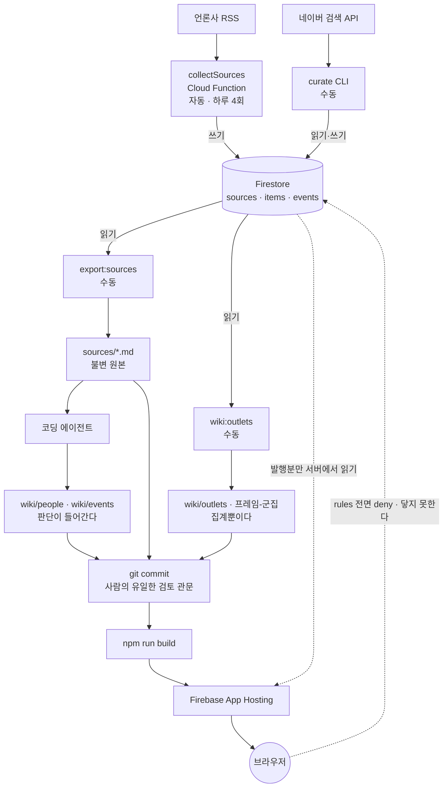

# 무엇이 어디에 있고, 언제 움직이는가

설계 배경은 [DESIGN.md](DESIGN.md), 남은 일은 [ROADMAP.md](ROADMAP.md),
클라우드 자동 운영은 [AUTOMATION.md](AUTOMATION.md), 기록 규칙은
[wiki/schema.md](../wiki/schema.md) 에 있다.
이 문서는 **저장소·Firestore·스크립트가 각각 무슨 역할이고 언제 실행되는가**만 다룬다.

기준일 2026-07-28.

---

## 0. 한 장 요약



핵심 한 줄: **Firestore는 발행 사건의 최신 원본이고, git 저장소는 코드·파생 기록이다.**
브라우저는 Firestore 를 절대 읽지 않는다.

---

## 1. 각각의 역할

### Firestore — 변하는 것을 담는다

`asia-northeast3`, Native mode. 컬렉션 셋.

| 컬렉션 | 무엇 | 누가 쓰나 |
|---|---|---|
| `sources` | 관찰 매체 25곳. 도메인·RSS 주소·수집 건강 상태 | `seed` (수동), `collectSources` (자동, health 만) |
| `items` | 수집한 기사 제목·URL·게시시각·제목 변경 이력 | `collectSources` (자동), `curate coverage` (수동) |
| `events` | 사건. 요약·발생시각·프레임·매체별 보도 여부 | `curate` 계열 (수동) |

**규칙은 전면 deny 다** (`firestore.rules`). 브라우저에서 오는 요청은 전부 거절된다.
접근하는 것은 서비스 계정을 쓰는 Cloud Function 과, 로컬에서 사람이 실행하는 CLI 뿐이다.

왜 이렇게 나눴나 — items 는 하루 수백 건씩 쌓이고 제목이 바뀐다. 이런 걸 git 에 넣으면
diff 가 잡음으로 뒤덮여 사람이 검토할 수 없다. **변하는 것은 Firestore, 확정된 것은 파일.**

### git 저장소 — 확정된 것을 담는다

| 경로 | 무엇 | 누가 만드나 | 고쳐도 되나 |
|---|---|---|---|
| `sources/YYYY-MM-DD/*.md` | 원본 기록. 매체·제목·URL·게시시각 | `export:sources` 스크립트 | **아니오. 불변이다** |
| `wiki/people/*.md` | 인물 페이지 | 코딩 에이전트가 손으로 | 예 |
| `wiki/events/*.md` | 사건 페이지 | 코딩 에이전트가 손으로 | 예 |
| `wiki/outlets/*.md` | 매체 페이지 (집계) | `wiki:outlets` 스크립트 | **아니오. 다시 돌리면 덮어쓴다** |
| `wiki/프레임-군집.md` | 매체 간 프레임 일치 | `wiki:outlets` 스크립트 | **아니오** |
| `wiki/index.md` `log.md` `schema.md` | 색인·이력·규칙 | 손으로 | 예 |
| `src/` `functions/` | 코드 | 손으로 | 예 |
| `.next/` | Next 빌드 산출물 | App Hosting GitHub 빌드 | gitignore |

**판단이 들어가는 페이지만 사람(에이전트)이 쓴다.** 매체 페이지는 전부 산수라서
손으로 쓰면 계산을 틀리고 매체가 늘수록 어긋나기만 한다. 그래서 스크립트로 내렸다.

### 로컬 스크립트 — 사람 또는 예약 큐레이터가 실행한다

전부 `functions/` 안에 있고 서비스 계정 자격증명(ADC)으로 Firestore 에 붙는다.
대화형으로도 실행하며, 일일 GitHub Actions에서는 Codex 큐레이터가 같은 명령을 사용한다.

### Cloud Function — 유일한 자동 실행

`collectSources` 하나뿐이다. RSS 를 읽어 `items` 에 넣는다.
네이버 검색은 부르지 않는다 — 보도 여부 판정은 사건이 정해진 뒤 사람이 로컬에서 한다.

### GitHub — 예약 큐레이션과 자동 배포

원격은 `git@github.com:EtainClub/ljm-wiki.git` 이다. 예약 Codex 작업은 승인 대기 PR을
만들고, 사용자의 병합만 `main`에 반영한다. 그 뒤 발행 workflow가 lint·typecheck·build를
통과시키고, `main` push를 감지한 App Hosting이 자동 롤아웃한다.
7 절에 이걸 어떻게 바꿀 수 있는지 적었다.

---

## 2. 언제 무엇이 실행되는가

### 자동 — 하루 4회

| 시각 (KST) | 무엇 | 어디에 쓰나 |
|---|---|---|
| 07 · 12 · 18 · 22시 | `collectSources` | Firestore `items` 신규 기사, 제목 변경 이력, `sources.health` |

`collectSources` 함수와 Scheduler 잡이 배포돼 있으며 잡 상태는 `ENABLED`다.
수동 재수집이나 점검이 필요할 때만 `npm --prefix functions run collect:once`를 쓴다.

### 수동 — 사건 하나를 기록하는 전체 흐름

사건 하나에 아래를 순서대로 친다. 모두 `functions/` 에서 실행한다.

```
npm --prefix functions run curate -- list "이재명"
```
후보 풀을 본다. **Firestore 읽기만.**

```
npm --prefix functions run curate -- new "<제목>" "2026-07-27 15:20"
```
사건 문서를 만든다. **`events` 에 초안(draft) 1건 쓰기.**

```
npm --prefix functions run curate -- set <id> summary "요약"
npm --prefix functions run curate -- set <id> wikiSlug "2026-07-27-읽히는-이름"
```
**`events` 갱신.** `occurredAt` 을 바꾸면 `date` 도 같이 옮겨진다.

```
npm --prefix functions run curate -- coverage <id> "<검색어>" 40
```
가장 무거운 단계다. 네이버 검색을 페이지 단위로 훑어 매체별 최초 기사를 찾는다.
**`events.coverage` 쓰기 + 검색으로만 발견된 기사를 `items` 에 신규 생성 + `items.eventId` 배정.**
시간창을 다 훑지 못하면 저장하지 않고 멈춘다 — '보도하지 않음' 을 사실로 쓸 수 없기 때문이다.

```
npm --prefix functions run curate -- pending <id>
npm --prefix functions run curate -- frame <id> <키> "<라벨>" <항목...>
npm --prefix functions run curate -- drop <id> <항목>      # 이 사건 기사가 아닌 것
npm --prefix functions run curate -- attach <id> <항목>    # 검색이 놓친 기사
```
**`events.frames` 쓰기.** `drop`/`attach` 는 `coverage` 와 `items.eventId` 도 건드린다.

```
npm --prefix functions run curate -- show <id>
npm --prefix functions run curate -- publish <id>
```
`show` 는 읽기만. `publish` 는 검증을 통과해야 **`events.status = published`** 로 바꾼다.
검증에 걸리는 것: 요약 없음, 보도 0건, 프레임 2개 미만, 프레임 미배정 기사,
사라진 항목을 가리키는 프레임, 발생 시각보다 이른 기사.

```
npm --prefix functions run export:sources -- --event <id>
```
**Firestore 읽기 → `sources/YYYY-MM-DD/*.md` 파일 생성.**
이미 있는 파일은 건드리지 않는다. 이게 위키의 근거 자료다.

```
"wiki/schema.md 를 읽고 sources/2026-07-27/ 을 ingest 해줘"
```
코딩 에이전트에게 시킨다. 에이전트가 `wiki/events/*.md` 와 `wiki/people/*.md` 를 쓴다.
**Firestore 를 건드리지 않는다. 파일만 만든다.**

```
npm --prefix functions run wiki:outlets
```
**Firestore 읽기 → `wiki/outlets/*.md` 25개와 `wiki/프레임-군집.md` 생성.**
발행된 사건만 읽는다.

```
npm --prefix functions run wiki:lint
```
파일만 본다. 깨진 링크·고아 페이지·평가어·출처 없는 인용·'함께 언급' 비대칭과 건수 불일치를 잡는다.
**고치지 않는다.** 발견하면 종료 코드 1.

```
git diff
git add . && git commit
```
**사람이 검토하는 유일한 관문이다.** 에이전트는 커밋하지 않는다.
실존 인물·매체에 대한 기록이므로, 사람이 눈으로 보지 않은 문장이 발행되면 안 된다.

```
npm run build && npm start
```
이 명령은 배포 전 SSR 확인용이다. 운영 배포는 `main` 병합 뒤 App Hosting이 한다.

### 어쩌다 한 번

| 명령 | 언제 |
|---|---|
| `npm --prefix functions run seed` | `sources.seed.ts` 의 매체 목록을 고쳤을 때 |
| `npm --prefix functions run probe` | RSS 피드가 살아 있는지 점검할 때 |
| `npm --prefix functions run inspect` | 수집 현황·제목 변경을 훑어볼 때 |
| `npm --prefix functions run coverage -- "<검색어>" <시간>` | 사건을 만들기 전에 보도 분포를 미리 볼 때 (Firestore 에 쓰지 않는다) |

---

## 3. 위키는 어떻게 동작하는가

Karpathy 의 LLM wiki 방식이다. **원본을 넣으면 노드가 생기고, 계속 갱신된다.**

```
Firestore items ──export:sources──▶ sources/*.md  (불변 원본)
                                          │
                                          ▼
                                   코딩 에이전트가 읽는다
                                   (wiki/schema.md 규칙에 따라)
                                          │
                     ┌────────────────────┴────────────────────┐
                     ▼                                         ▼
           wiki/events/<사건>.md                     wiki/people/<인물>.md
                     │                                         │
                     └────────────────┬────────────────────────┘
                                      ▼
                              wiki/index.md · log.md
                                      │
                    wiki:outlets ─────┤ (스크립트가 따로 생성)
                                      ▼
                        wiki/outlets/*.md · 프레임-군집.md
                                      │
                              wiki:lint 로 검사
                                      ▼
                              git diff → 사람이 커밋
                                      ▼
                        npm run build → /w 아래 정적 페이지
```

**기록 대상은 인물이 아니라 보도다.** 이게 이 위키의 전부다.

- ✗ 금지: "정성호는 친명계 핵심 인물이다"
- ✓ 허용: "정성호의 사의 표명을 22개 매체가 보도했다"

**이재명 필터** — `wiki/people/` 에 페이지가 있는 인물이 곧 필터다. 씨앗은 이재명 혼자였고,
같은 제목에 등장한 인물이 페이지를 얻으면서 필터가 넓어진다. 진영으로 거르지 않는다 —
그러면 네트워크가 순환한다.

**사람과 에이전트의 분담**

| | 사람 | 에이전트 |
|---|---|---|
| 원본 선정·사건 정의 | ○ | |
| 발생 시각 판단 | ○ | |
| 프레임 라벨·경계 | ○ | (초안만) |
| 마크다운 작성 | | ○ |
| 교차참조 유지 | | ○ |
| lint 실행 | | ○ |
| **커밋** | **○** | **✗** |

`/w` 아래 페이지는 빌드 시 `wiki/*.md` 를 읽어 만든다. Firestore 와 무관하다.
`[[people/정성호]]` 는 링크가 되고, `[[outlets/chosun|조선일보]]` 처럼 표시 이름을 줄 수 있다.
대상 파일이 없으면 링크로 만들지 않는다 — 404 를 보여주는 것보다 낫다.

> ⚠ `next dev` 는 한글 경로를 `generateStaticParams()` 와 대조하지 못해 실패한다.
> 위키를 로컬에서 보려면 `npm run build` 후 `npm run serve:out`.

---

## 4. Firestore 에 언제 써지는가 (요약)

| 무엇을 하면 | 어느 컬렉션에 | 자동/수동 |
|---|---|---|
| `collectSources` 실행 | `items` 신규·제목변경, `sources.health` | **자동** 하루 4회 |
| `collect:once` | 위와 같음 | 수동 |
| `seed` | `sources` 전체 | 수동, 어쩌다 |
| `curate new` | `events` 초안 1건 | 수동 |
| `curate set` | `events` 해당 필드 | 수동 |
| `curate coverage` | `events.coverage`, `items` 신규, `items.eventId` | 수동 |
| `curate frame` / `drop` / `attach` | `events.frames`, `events.coverage`, `items.eventId` | 수동 |
| `curate publish` | `events.status` | 수동 |
| `curate delete` | `events` 삭제, `items.eventId` 해제 | 수동 |
| **빌드 · 사이트 방문** | **쓰지 않는다** | — |

**읽기 전용인 것**: `npm run build`, `export:sources`, `wiki:outlets`,
`curate list/show/pending`, `coverage-check`, `inspect`.
**Firestore 를 아예 안 쓰는 것**: `wiki:lint` (파일만 본다).

---

## 5. 리모트에 배포하기

### 준비

빌드는 서비스 계정 자격증명(ADC)으로 Firestore 를 읽는다. 없으면 조용히 실패하지 않고
**샘플 데이터로 빌드하면서 경고를 찍는다** — 빌드 로그에 이 줄이 보여야 진짜 데이터다:

```
[events-source] Firestore 에서 사건 N건을 읽었습니다.
```

프로젝트 id 와 도메인은 `.firebaserc` 에서 온다. 환경변수는 없어도 된다.
필요한 환경변수의 정본은 [.env.example](../.env.example) 이다.

### 배포 세 가지

```bash
npm run deploy:rules
```
`firestore.rules`(전면 deny)와 인덱스를 반영한다. **가장 먼저 한다** —
규칙이 열린 채로 데이터가 올라가 있으면 안 된다.

```bash
npm run deploy
```
평소에는 쓰지 않는 비상용 수동 App Hosting 롤아웃이다. 정상 흐름은 GitHub `main` push이며,
배포 주소는 `https://ljm-wiki--new-ljm.asia-east1.hosted.app`이다.

```bash
npm --prefix functions run deploy
```
`collectSources` 를 배포한다. Cloud Scheduler 잡이 함께 생기고,
그때부터 하루 4회 자동 수집이 시작된다. 시크릿은 필요 없다 — 발굴은 RSS 만 쓴다.

### 언제 다시 배포하나

| 바뀐 것 | 다시 해야 하는 것 |
|---|---|
| 사건을 발행했다 (`curate publish`) | `main`에 파생 기록 commit push → App Hosting 자동 롤아웃 |
| 위키 마크다운을 고쳤다 | `main` push → App Hosting 자동 롤아웃 |
| 코드(`src/`)를 고쳤다 | `main` push → App Hosting 자동 롤아웃 |
| 수집기(`functions/src/collect/`)를 고쳤다 | `npm --prefix functions run deploy` |
| `firestore.rules` 를 고쳤다 | `npm run deploy:rules` |
| 큐레이션 스크립트만 고쳤다 | **아무것도 안 해도 된다** (로컬에서만 돈다) |

**사건 화면은 동적 SSR이다.** `published` 상태는 App Hosting 서버가 다음 요청에서 Firestore로
읽는다. 승인 workflow가 원본·위키 이력을 commit한 뒤 `main`을 push하므로 배포 이력도 남는다.

---

## 6. 무엇이 무엇을 막고 있나 (안전장치)

| 장치 | 무엇을 막나 |
|---|---|
| `firestore.rules` 전면 deny | 브라우저에서 오는 모든 접근 |
| `curate coverage` 의 `truncated` 검사 | 시간창을 다 훑지 못했는데 '보도하지 않음' 을 쓰는 것 |
| `validateForPublish` | 요약 없음·프레임 부족·사라진 항목·발생 시각보다 이른 기사 |
| `applyCoverage` 의 소유권 검사 | 다른 사건의 기사를 빼앗아 가는 것 |
| `wiki:lint` | 깨진 링크·평가어·출처 없는 인용·교차참조 어긋남 |
| **`git diff` 와 사람의 커밋** | **검토되지 않은 문장이 발행되는 것** |
| `sources/` 불변 | 원본이 나중에 조용히 바뀌는 것 |

마지막 두 개가 가장 중요하다. 나머지는 기계가 잡을 수 있는 것들이고,
"이 문장을 실존 인물 이름 아래 남겨도 되는가" 는 사람만 판단할 수 있다.

---

## 7. GitHub Actions 자동 발행

ChatGPT 데스크톱 앱의 Codex 예약 작업은 매일 22:30 KST에 사건을 최대 1건 처리해
`ready` 상태와 승인 대기 PR만 만든다. 사용자가 이 PR을 병합하면
`.github/workflows/publish-ready.yml`이 `ready` 상태를 다시 검증하고 `published`로
전환한 뒤, 원본·집계·lint·build·Hosting 배포를 수행한다.

발행 workflow에 필요한 GitHub Actions secrets는
`GCP_WORKLOAD_IDENTITY_PROVIDER`, `GCP_SERVICE_ACCOUNT`다. Codex 예약 작업은 구독으로
로컬에서 실행하며 OpenAI API 키를 쓰지 않는다. 네이버 키는 로컬 예약 작업의
`.env.local`에만 둔다.

로컬에서 검토한 커밋을 원격에 올리려면:

```bash
git push origin main
```

승인 흐름은 ingest 한 건에 브랜치 하나, PR 하나다:

```bash
git switch -c ingest/2026-07-27-브라질-국빈방문
# ... 에이전트가 wiki/를 쓰고, curate -- ready와 queue:approval을 실행하고 ...
npm --prefix functions run wiki:lint
git add wiki sources .automation && git commit
gh pr create
```

PR의 사전 검증도 CI로 추가할 수 있다. `.github/workflows/` 에 넣을 것:

- `wiki:lint` — 깨진 링크·평가어·교차참조 어긋남
- `tsc --noEmit` 양쪽 + `eslint`
- `npm run build` — 단, Firestore 자격증명이 CI 에 없으면 샘플로 빌드된다.
  서비스 계정 키를 시크릿으로 넣거나, 빌드 검증은 문법 수준까지만 한다.

**주의** — `sources/` 와 `wiki/` 에는 실존 인물·매체에 대한 기록이 들어간다.
저장소를 공개로 두면 그 기록이 사이트보다 먼저, 그리고 정정 이력 없이 노출된다.
공개 전환은 별도로 판단할 문제다.

예약 작업의 배포는 자동이며, 일반 로컬 변경의 배포는 여전히 사람이 실행한다.
